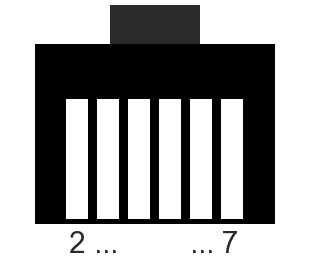

# FT-857D Front Panel Hardware
Some basic information on the hardware. For details please refer to the service manual.

## Connector TRX <-> PAN
Tranceiver and front panel both use an __RJ12 6P6C__ jack and a straight connection cable.

 RJ12 Plug

Pin |  Signal         | Remarks
----|-----------------|-------------------------------------------------
2   | Audio			      | Audio amp output for headphones or ext. speaker
3   | Power button    | Only connected to the TRX, not the panel's microcontroller
4   | GND             |
5   | 8V              | TO DO: measure current draw
6   | Data TRX->PAN   |
7   | Data PAN->TRX   |

__Hint__: RJ12 plugs do fit in RJ45 couplers -> Easy, non-destructive way to sniff the signal.

## Serial
This is a normal UART. The data lines operate at __5V__ logic level.

The bitrate is __62 kBit/s__, 8N2.
 
