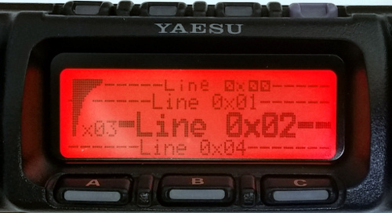

# FT-857D Front Panel Protocol
The following describes the serial protocol between the FT-857D tranceiver and the front panel. It is based on the analysis of __one device__. 

__Work in progress!__ The protocol description is far from being complete and verified! Use at your own risk.

## Communication
Both, the tranceiver (TRX) and the front panel (PAN) may initialize a data transfer. The scheme is:
 1. Sender transmits 0xA5
 2. Receiver replies 0x06 (ACK)
 3. Sender transmits data frame
 4. Receiver replies 0x06 (ACK)

__Example: TRX initiates a data transfer:__
 1. TRX -> PAN: 0xA5
 2. TRX <- PAN: 0x06
 3. TRX -> PAN: [data frame]
 4. TRX <- PAN: 0x06
 
When idle, the TRX sends 0x90 every second. PAN replies with 0x06.

## Data frames
After the initialisation (see above), the data frame is transmitted. It consists of a length byte, a command byte, one or more data bytes and the checksum.

`[1 len] [1 cmd] [len-2 data] [1 checksum]`

* __len__: Number of following bytes (rest of the frame), including checksum byte.
* __cmd__: "Command" byte
* __data__: Command specific data
* __checksum__: 8 bit checksum, the sum of cmd and all data bytes

Example:
`06 91 FF 8F 18 00 37`

## Commands TRX -> PAN
### 0x41 Display Control
Data: `[0x41] [Line] [Position] [Chars ... ]`

Manipulate the display text and symbols. The display is organized in lines of different text styles and column counts. _Line_ selects the display line (see below), _Position_ the character position within the line where the characters _Chars_ to be placed.

 * __Line 0x00__: 19 chars, Top line with symbols and volt meter
 * __Line 0x01__: 20 chars, VFOx/Mem, Mode
 * __Line 0x02__: 12 chars, Frequency  
  Position 0 collides with line 0x03. Use 1 or higher.  
  Special characters 0x12: IF shift dot, 0x16/0x17: clar arrow down/up, ...
 * __Line 0x03__: 3 chars, S/MFx area left of frequency line
 * __Line 0x04__: 22 chars, Menu Bar (button labels)  
	special character 0x7D: lock symbol
 
Examples: 
`41 04 15 7D D7` -> sets the lock symbol 
`41 02 01 20 20 35 30 2E 32 34 37 2E 37 37 20 70` -> sets frequency display to "  50.247.77 "

Here is still some work to do! Valid and special characters to be verified. Note that the menu structure works differently from the normal display control.

### 0x43 Display Meter
Data: `[0x43] [Value]`

Value for the on-screen meter, eg. S-meter. Range: 0x00 - 0x64 (=100, full scale). For some reason, the meter aperantly must first be written 0x00 before it accepts higher values correctly.

### 0x45 Cursor
Data: `[0x45] [Line] [Position]`

Places a blinking cursor at the given line and position. Only used (usable) in line 2?

### 0x4A Display Backlight Control
Data: `[0x4A] [BL0] [BL1]`

Controls the RGB LED backlight of the LC display. 4 bit per color:

Bit   |     7     |     6     |     5     |      4     |     3     |     2     |     1     |     0     
------|-----------|-----------|-----------|------------|-----------|-----------|-----------|----------
BL0   | green MSB | green     | green     | green LSB  | blue MSB  | blue      | blue      | blue LSB
BL1   | ?         | ?         | ?         | ?          | red MSB   | red       | red       | red LSB

### 0x4B LED Control
Data: `[0x4B] [LED]`

Controls the BUSY/TX/CW RGB LED and button backlight.

Bit   |     7     |     6     |     5     |      4     |     3     |     2     |     1     |     0     
------|-----------|-----------|-----------|------------|-----------|-----------|-----------|----------
LED   | Buttons   | 0         | 0         | 0          | /BUSY bl  | 0         | /BUSY gn  | /BUSY rd

Note that the BUSY LED is active low while the button backlight is active high. Trying to set bit 4, 5 or 6 locks up the panel. Function unclear.

Examples: 
`4B 89` -> buttons on, green LED on 
`4B 8B` -> buttons on, green LED off,

### 0x4C Ext Meter
Data: `[0x4C] [Value]`

Output value for the external analog meter. Depends on the setting of menu 60 "MTR ARX SEL" and 61 "MTR ATX SEL". Range: 0x00 - 0xFF

### 0x4D Display Contrast
Data: `[0x4D] [Contrast]`

LC Display contrast 0x03 ... 0x0F 

## Commands PAN -> TRX
### 0x91 Buttons
Data: `[0x91] [Btn0] [Btn1] [Btn2] [Btn3]`

A change in the set of buttons triggers a data frame, containing all button states. If a button is pressed, the corresponding bit is 0. __Btn3__ seems to be always 0x00 but might have a special function. HP bit is 0 if the headphone jack is in use.

Bit   |     7     |     6     |     5     |      4     |     3     |     2     |     1     |     0     
------|-----------|-----------|-----------|------------|-----------|-----------|-----------|----------
Btn0  | MODE <    | MODE >    | BAND DWN  | BAND UP    | FUNC      | V/M       | LOCK      | DSP
Btn1  | HP (in)   | 0         | 0         | 0          | HOME      | A         | B         | C
Btn2  | 0         | 0         | 0         | SELECT     | CLA       | 0         | 0         | 0

Example: 
 * __A__ pressed, no headphones connected: `06 91 FF 8B 18 00`
 * __A__ released again: `06 91 FF 8F 18 00`

The same data is being sent as command __0x9A__ during startup. Maybe a button query reply?
 
### 0x92 Dial
Data: `[0x92] [Direction] [Steps]`

This frame is sent, when the __main dial__ is operated.
 * __Direction__: __0x00 for clockwise__ or __0x80 for counterclockwise__
 * __Steps__: Number of steps since the last transmission. 0x01 when operated very slowly, higher values up to ~0x06 when operated really fast. 
 
### 0x93 Select
Data: `[0x93] [Direction] [Steps]`
 
This frame is sent, when the __select knob__ is operated.
Works like the main dail (0x92 above). Knob presses are sent using the buttons-method (0x91).

### 0x95 SQL/RF
Data: `[0x95] [Value]`

Sent on change of the SQL/RF knob setting. Value range 0x00 ... 0xFF.

### 0x97 Volume
Data: `[0x97] [Volume]`

Sent on change of the VOL knob setting. Volume range 0x00 ... 0xFF.

# Sharing
This work is licensed under a [Creative Commons Attribution 4.0 International License](https://creativecommons.org/licenses/by/4.0/).
Thomas Kottek 2017
